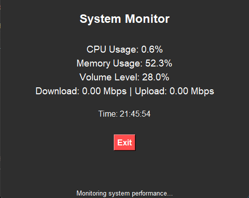

# System Monitor

A simple system monitoring application built with Python and Tkinter. This app collects and displays real-time system statistics, including CPU usage, memory usage, network speed, system volume level, and current time.

## Features

- **CPU Usage Monitoring**: Displays current CPU usage as a percentage.
- **Memory Usage Monitoring**: Shows memory usage as a percentage.
- **Network Speed Monitoring**: Monitors and shows download and upload speeds in Mbps.
- **Volume Level Monitoring**: Retrieves and displays the system's current audio volume level.
- **Current Time Display**: Updates every second with the current system time.
- **User Interface**: Simple, dark-themed Tkinter GUI with real-time updates.



## Notes

- This application is designed to run on Windows due to the dependency on `pycaw` for volume control.
- Ensure you have administrator privileges if you encounter access errors when gathering system information.

## Requirements

This project uses the following Python packages:

- `psutil`: To gather system statistics like CPU, memory, and network speed.
- `tkinter`: For creating the GUI.
- `pycaw`: For accessing system volume information on Windows.
- `comtypes`: Required by `pycaw` for interfacing with Windows COM objects.

Install the necessary packages using:

```bash
pip install psutil pycaw comtypes tkinter
